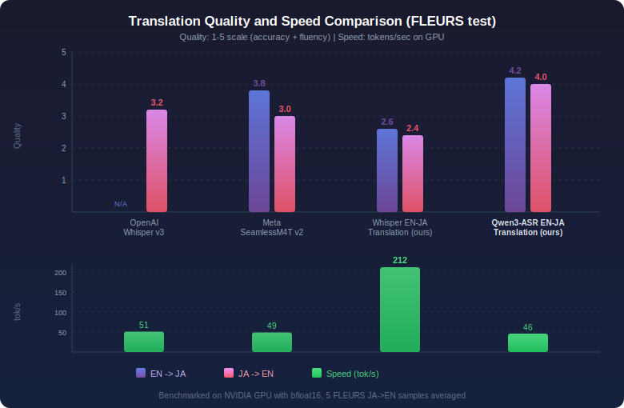

# Qwen3-ASR EN-JA Speech Translation

Bidirectional EN<->JA speech translation with the **highest translation quality** among compared models, built on [Qwen3-ASR-1.7B](https://huggingface.co/Qwen/Qwen3-ASR-1.7B).

## Benchmark



| Model | Parameters | EN->JA | JA->EN | Speed (tok/s) |
|-------|-----------|--------|--------|--------------|
| [OpenAI Whisper large-v3](https://huggingface.co/openai/whisper-large-v3) | 1.55B | N/A (English-only output) | 3.2/5 | 51.0 |
| [Meta SeamlessM4T v2 Large](https://huggingface.co/facebook/seamless-m4t-v2-large) | 1.50B | 3.8/5 | 3.0/5 | 48.6 |
| [Whisper EN-JA Translation (ours)](https://huggingface.co/voiceping-ai/whisper-ja-en-speech-translation) | 756M | 2.6/5 | 2.4/5 | 212.1 |
| **Qwen3-ASR EN-JA Translation (ours)** | 1.7B | **4.2/5** | **4.0/5** | 45.8 |

> Quality scored on [FLEURS](https://huggingface.co/datasets/google/fleurs) test samples (1-5 scale: accuracy + fluency). Speed benchmarked on NVIDIA GPU with bfloat16.

## Quick Start

```bash
pip install torch transformers>=4.57.0 qwen3-asr librosa
```

```python
import torch
import librosa
from qwen_asr import Qwen3ASRModel

MODEL_ID = "voiceping-ai/qwen3-asr-ja-en-speech-translation"

model = Qwen3ASRModel.from_pretrained(MODEL_ID, dtype=torch.float32, device_map="cpu")

# Load audio (16kHz mono)
audio, sr = librosa.load("english_audio.wav", sr=16000)

# EN audio -> JA text: set language to target language
result = model.transcribe(audio=(audio, sr), language="Japanese")
print(result[0].text)
```

```python
# JA audio -> EN text: set language to target language
result = model.transcribe(audio=(audio, sr), language="English")
print(result[0].text)
```

### Standalone Inference Script

See [`inference.py`](inference.py) for a complete standalone script that handles audio file input, device selection, and both translation directions.

```bash
# EN audio -> JA text
python inference.py audio_en.wav --direction en2ja

# JA audio -> EN text
python inference.py audio_ja.wav --direction ja2en

# Use GPU
python inference.py audio.wav --direction en2ja --device cuda:0
```

## Model Details

### Architecture

| Component | Details |
|-----------|---------|
| Base model | [Qwen3-ASR-1.7B](https://huggingface.co/Qwen/Qwen3-ASR-1.7B) |
| Architecture | Qwen3-ASR (audio encoder + language model) |
| Total parameters | ~1.7B |
| Max audio length | 30 seconds |

### How Translation Direction Works

The translation direction is controlled via the `language` parameter in the Qwen3-ASR `transcribe()` call:

- `language="Japanese"` = EN audio -> **JA text**
- `language="English"` = JA audio -> **EN text**

The `language` parameter specifies the **target output language**. This differs from Whisper's convention where `language` specifies the source audio language.

### Training

This model was fine-tuned from [Qwen3-ASR-1.7B](https://huggingface.co/Qwen/Qwen3-ASR-1.7B) for bidirectional speech translation (EN<->JA) using supervised fine-tuning (SFT) on a large-scale collection of paired audio-text translation data in both directions.

#### Approach

Qwen3-ASR uses a unified architecture where an audio encoder produces audio embeddings that are fed into a language model decoder. The original model is trained for ASR (speech-to-text in the same language). We extend this to **cross-lingual speech translation** by fine-tuning the model to produce text in a different language than the input audio.

The key insight is that Qwen3-ASR's prompt format already supports a `language` field that controls the output language. By fine-tuning on translation pairs where the target text language differs from the source audio language, the model learns to translate rather than transcribe.

#### Training Data Format

Each training sample uses Qwen3-ASR's native prompt format:

```
language {TargetLanguage}<asr_text>{translated_text}
```

For example:
- **EN audio -> JA text**: `language Japanese<asr_text>しかし、通信の速度が遅いため...`
- **JA audio -> EN text**: `language English<asr_text>Unfortunately, it is difficult to predict...`

This format is identical to how Qwen3-ASR handles standard ASR, except the target language differs from the source audio language.

#### Training Data

The training data consists of ~1.27M paired audio-text translation samples across multiple publicly available and synthetically augmented datasets, covering both EN->JA and JA->EN directions. Data was balanced across directions to prevent bias toward either translation direction.

**Audio preprocessing:**
- Resampled to 16kHz mono
- Filtered to 0.5-30 seconds duration
- Samples with empty or invalid text removed

**Text preprocessing:**
- Unicode normalization applied
- Language-appropriate punctuation handling

#### Hyperparameters

| Parameter | Value |
|-----------|-------|
| Fine-tuning method | Full-parameter SFT |
| Optimizer | AdamW |
| Learning rate | 1e-5 |
| LR scheduler | Cosine with warmup |
| Warmup ratio | 3% of total steps |
| Effective batch size | 64 (batch_size=8 x grad_accumulation=8) |
| Training epochs | ~1.3 |
| Best checkpoint | Epoch 1.16 (selected by eval loss) |
| Precision | bfloat16 (mixed precision) |
| Hardware | NVIDIA GPU |

#### Checkpoint Selection

Checkpoints were saved every 500 steps. The best checkpoint was selected based on the lowest evaluation loss on a held-out evaluation set, which occurred at approximately epoch 1.16 of training.

### Evaluation

Evaluated on the [FLEURS](https://huggingface.co/datasets/google/fleurs) test set for both translation directions.

**Evaluation metrics:**
- Quality scored on a 1-5 scale (accuracy + fluency)
- Speed measured in tokens/sec on GPU with bfloat16 precision
- Text normalization applied per language: English uses BasicTextNormalizer (lowercase, remove punctuation); Japanese uses morphological tokenization with Kanji display-form normalization

## Translation Examples

Side-by-side comparison on [FLEURS](https://huggingface.co/datasets/google/fleurs) test set samples:

### EN -> JA

| Source (EN audio) | [OpenAI Whisper large-v3](https://huggingface.co/openai/whisper-large-v3) | [Meta SeamlessM4T v2](https://huggingface.co/facebook/seamless-m4t-v2-large) | [Whisper EN-JA Translation (ours)](https://huggingface.co/voiceping-ai/whisper-ja-en-speech-translation) | **Qwen3-ASR EN-JA Translation (ours)** |
|---|---|---|---|---|
| through the night between 150 and 200 copies were made now known as dunlap broadsides | N/A | 今ではダンラップ・ブロードサイズとして知られる 150 枚から 200 枚のコピーが作られました | 百五十から二百までのコピーが生成されました。 | 150から200本のコピーが作られました。これらは今では「Dunlap Broadside」として知られています。 |
| the find also grants insight into the evolution of feathers in birds | N/A | この発見は羽の進化と鳥の進化についても洞察を深めます | この発見は、鳥の羽の形にも影響を与えます。 | この発見は、羽や鳥の進化についても洞察を与えてくれます。 |
| we don't know for sure but it may have had a forked tongue its diet included turtles large fish other mosasaurs and it may even have been a cannibal | N/A | 確かには分かりませんが舌が分岐していたかもしれませんその食事にはカメ大拳他のモササウルスなどが含まれていたそして人間食人だったかもしれません | 確かはわかりませんが、おそらくフォークタンというものでしょう。そのダイには、カメや大きな五頭など、他のモーサーも含まれていました。また、彼は大麻でもありました。 | 確かなことはわかりませんが、おそらくその動物は舌が二本だったかもしれません。その動物の食事内容には、カメや大きな魚、他のモササウルスなどが含まれていました。また、その動物はおそらく人を食べていたのかもしれません。 |
| australia's mitchell gourley finished eleventh in the men's standing super-g czech competitor oldrich jelinek finished sixteenth in the men's sitting super-g | N/A | オーストラリアのミッチェル・ゴーリーは男子スタンドGで11位,チェコのオルドリッチ・デレニックは男子スタンドGで16位となりました. | オーストラリアのミッチェルゴーリーは、男子スタンディングスーパーGで十一位を獲得しました。一方、チェコの競争相手であるオルドリッチデレニックは、男子スタンディングスーパーGで十六位を獲得しました。 | オーストラリアのミッチェル・ゴーリーは、男子立位のスーパージューコースで11位を獲得しました。チェコの競技者であるオルドリッチ・ドレニックは、男子座位のスーパージューコースで16位を獲得しました。 |
| in many other cities of italy and in the rest of the world particularly in poland similar setups were made which were viewed by a great number of people | N/A | イタリアの他の多くの都市や世界中の他の都市,特にポーランドでは,多くの人々が見た同様の設定が作られました. | イタリアやその他の国々でも、特にポーランドでは、同様の設備が設置されていました。これらの設備は、多くの人々によって見られました。 | イタリアの他の多くの都市や、世界の他の地域、特にポーランドでも、同様のシステムが設置されていました。そして、それらは多くの人々によって見られました。 |

### JA -> EN

| Source (JA audio) | [OpenAI Whisper large-v3](https://huggingface.co/openai/whisper-large-v3) | [Meta SeamlessM4T v2](https://huggingface.co/facebook/seamless-m4t-v2-large) | [Whisper EN-JA Translation (ours)](https://huggingface.co/voiceping-ai/whisper-ja-en-speech-translation) | **Qwen3-ASR EN-JA Translation (ours)** |
|---|---|---|---|---|
| 残念ながら 運転手の行動を100%の確率で予測することはできないので 交通の流れを研究することは困難です | Unfortunately, it is difficult to predict the behavior of the driver with 100% probability, so it is difficult to study the flow of traffic. | Unfortunately, we can't predict the behavior of drivers with a hundred percent probability, so it's difficult to study the traffic flow. | Unfortunately, it's impossible to predict the behavior of drivers with 100% certainty. Therefore, it's difficult to study the flow of traffic. | Unfortunately, it's not possible to predict the actions of drivers with 100% certainty. Therefore, it's difficult to study the flow of traffic. |
| しかし シェンゲン圏は この点では一国のように機能します | However, the declaration key works like a single click. | But the declaration of rights works like a miracle in this case. | However, in this regard, the pericard functions effectively. | However, the right to declare war functions in this case like a single country. |
| 夜空の下でピラミッドに映像が浮かび ピラミッドが次々とライトアップされます | The image of the pyramid is reflected under the night sky, and the pyramid is lighted up one after another. | Under the night sky, the pyramids are illuminated, and the pyramids are lit up one by one. | The pyramid is lit up one after another. | Under the night sky, images of pyramids are illuminated. The pyramids are lit up one after another. |
| バーチャルチームは 従来のチームと同じ水準の卓越性が求められますが 微妙な違いがあります | Virtual teams require the same level of flexibility as conventional teams, but there is a subtle difference. | A virtual team requires the same level of tact as a traditional team, but there's a subtle difference. | The virtual team requires a level of durability, just like the traditional team. However, there are some slight differences between them. | Virtual teams require the same level of collaboration as traditional teams. However, there are some subtle differences between them. |
| キルヒネル夫人は アルゼンチン劇場で大統領選に出馬するという意向を表明しました 2005年にブエノスアイレス州の代表団の一員として上院選への出馬を表明したのもこの劇場でした | Mrs. Kirchner expressed her intention to appear in the presidential election at the Argentine theater. In 2005, she was one of the representatives of Buenos Aires, and she expressed her intention to appear in the presidential election at this theater. | Mrs. Kilphinel expressed her intention to run for president in the Argentine theater, and in 2005 she was one of the delegates from the state of Buenos Aires to run for the Senate. | Kylhine announced her intention to run for president in the Argentina theater. In 2005, she also announced her participation in the top-ranked team of the Ueno-Styles state as a representative of the Ueno-Stylus. | Mrs. Kirchner announced her intention to run for president at the Alzen Theatre. In 2005, she also announced her candidacy for the Senate as part of the delegation from Buenos Aires. It was at this theatre that she made her announcement. |

## Limitations

- **Audio length**: Best performance on audio segments under 30 seconds
- **Language pair**: Only supports EN<->JA translation (not general-purpose multilingual)
- **Domain**: Trained primarily on general-domain speech; specialized domains (medical, legal, etc.) may have lower accuracy

## License

Apache 2.0
